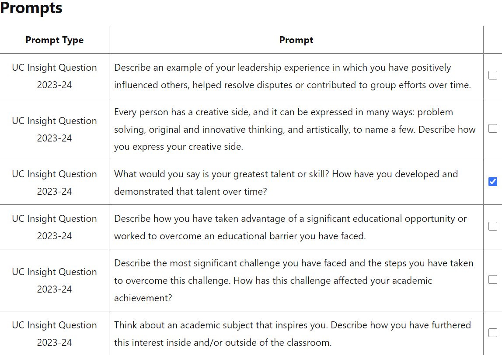
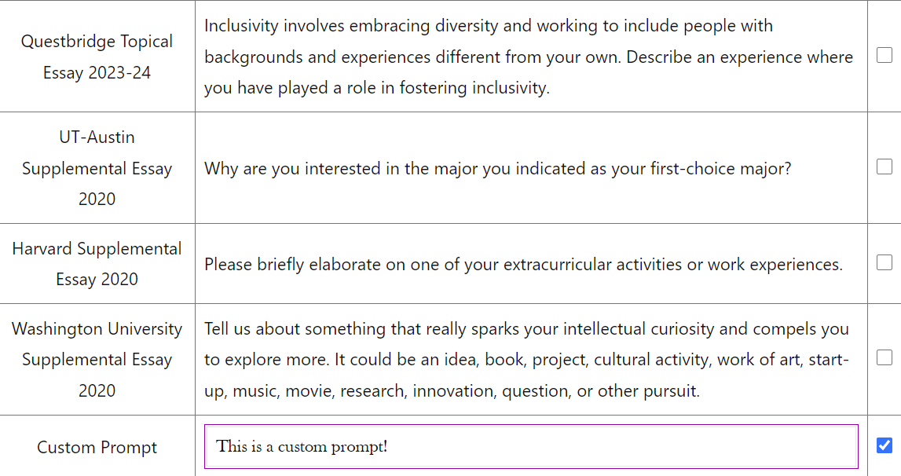
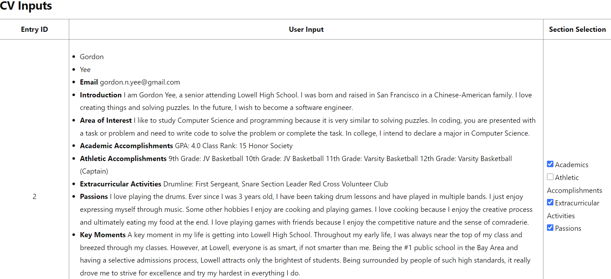
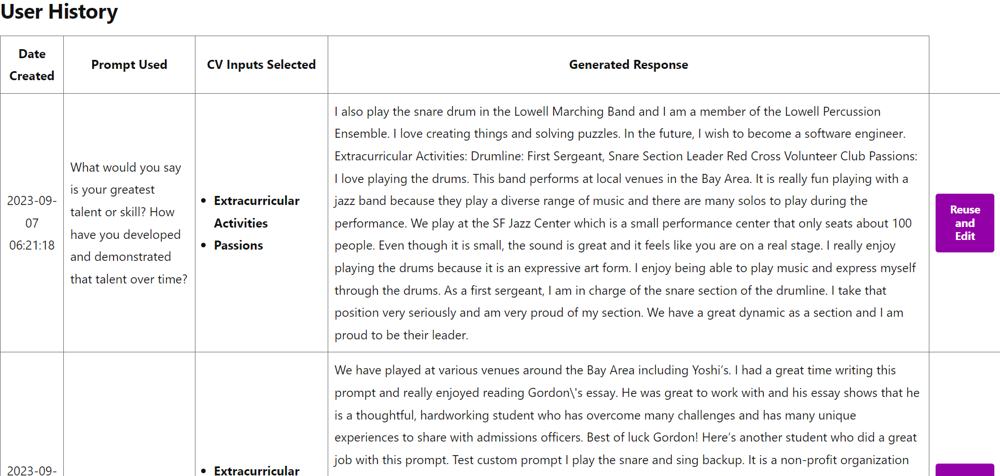
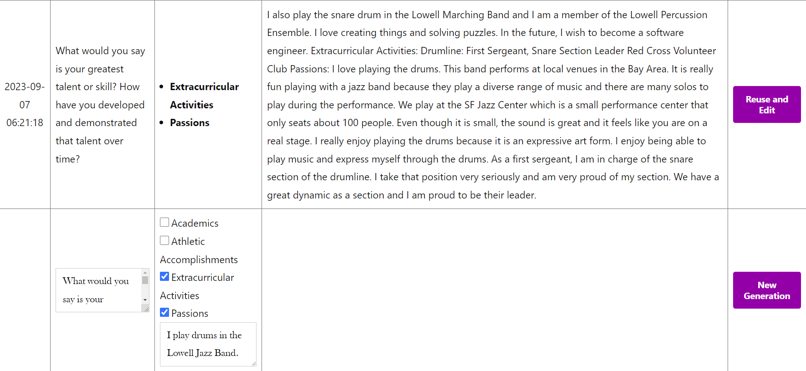
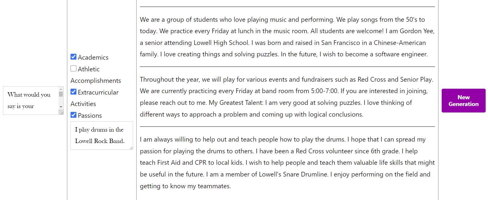

# GIG College Essay Writer

**Contributors:** Clarissa Chen and Gordon Yee

## Description

A plugin and page template that integrates GIG's College Essay Writer with your WordPress site.

## Installation

Download `gig-custom-plugin.zip` and `generate-page-template.php` from this repository.

### Custom Plugin

1. In the WordPress dashboard, go to the `Plugins` section. You can usually find it on the left-hand menu. Click on `Plugins` to access the plugins management page.
2. On the `Plugins` page, there will be an `Add New` button near the top. Click on it to proceed.
3. Click on the `Upload Plugin` button located at the top of the page.
4. Click the `Choose File` button and select the `gig-custom-plugin.zip` file.
5. Once you've selected the .zip file, click the `Install Now` button. WordPress will begin the process of uploading and installing your plugin.
6. After the plugin is successfully installed, you'll see a success message. From there, you can click the `Activate Plugin` link. This will activate your custom plugin on your WordPress website.

### Custom Page Template

1. Connect to your WordPress website's hosting server using FTP or a file manager provided by your hosting provider. Navigate to the directory where your WordPress theme is located, usually in the `wp-content/themes/` folder. Upload the `generate-page-template.php` file to your theme's folder.

## Usage

### Custom Plugin

1. Upon plugin activation, a new tab titled `GIG` will be added to WP admin dashboard `Settings`. Select this page by clicking "Settings" and selecting `GIG`.
    > 
2. Enter your API `User ID` and `User Key` in the respective fields.
3. Click `Save Changes`. Your API ID and Key will now be stored in the WordPress Database for future use.
    > 

### Custom Page Template

**Assign the Template to a Page:**  

> Now that your template is uploaded, go to your WordPress dashboard and create or edit a page where you want to use the custom template. In the `Page Attributes` section on the right-hand side, you'll see `Template` in the summary. It will likely be set to `Default template`. Click on `Default template` or whatever template is listed there to open the template dropdown menu. Once the dropdown menu is opened, and you should see the `Generate Page` template listed there. Select `Generate Page`.

**Publish or Update the Page:**  

> After selecting the `Generate Page` template, click the `Publish` button if you're creating a new page or the `Update` button if you're editing an existing page. The page will now use the layout and structure defined in `Generate Page` template.

**View the Page:**  

> Visit the page on your website that you assigned the `Generate Page` template to. You should see the layout and design defined in the `generate-page-template.php` file.

## User Flow

1. Fill out and submit a response to the CV Input form (Gravity Forms).
2. Click on the page that the `Generate Page` template is active.
3. At the top of the page, you should see the `Prompts` table.
4. Select the desired prompt you want to use for the current essay generation by using the checkboxes on the right.
    > 
    > If you desire to use a prompt not _already_ listed in the table, at the bottom of the table, type in your desired prompt in the text box under `Custom` and select the checkbox on the right.
    > 
5. Scroll down to the `CV Inputs` table and select the desired inputs you want to include by using the checkboxes on the right.
    > 
    > If you desire to add additional information that isn't already listed in the table, at the bottom of the table, type in any additional input in the text box under `Additional Information`. (This input will be included in the generation prompt in addition to the selected CV inputs.)
    > 
6. Underneath the table, there should be a blank box under the header `Generated Response`. Click the `Generate` button next to the box and wait for the AI to process selected information. (This may take a few seconds.)
    > 
    > You should now see the AI generated response within the response box. (In the chance that an error occurs, simply click the generate button once more to try again.)
    > 
7. Upon page refresh, your last generation (and any previous ones) should be displayed under the `User History` table. This table is a record of all past generations made by the logged-in user.
    > 
8. If you desire to edit and finetune a previous submission for re-generation, click the `Reuse and Edit` button on the right side. (This will eventually create a brand new response. Your original response will be saved.)
    > 
    >
    > 1. A new row will pop up for editing directly underneath the selected submission. Feel free to edit the content of the text boxes to whatever you desire.
    > 2. Click the `New Generation` button and wait for the AI to process your edited submission.
    > 3. The new response will appear in the empty cell under the `Generated Response` column in the table.
    >     > 
9. Refresh the page to see new generations in the `User History` table if desired.

## Administration

These data tables can be found in the WordPress database.

**wp_gig_user_history_table**

> Stores all user generation activity. (Prompt used, user inputs selected, generated response, etc.)

**wp_gig_prompts**

> Stores common College application prompts that are sent to be displayed on the page. Will be empty upon plugin activation so needs to be populated. (ex. UC Insight Questions, Common App, etc.)

**wp_usermeta**

> `user_credits_used` - Tracks how many times the user calls the essay generator API (AKA how many credits the user has used).
